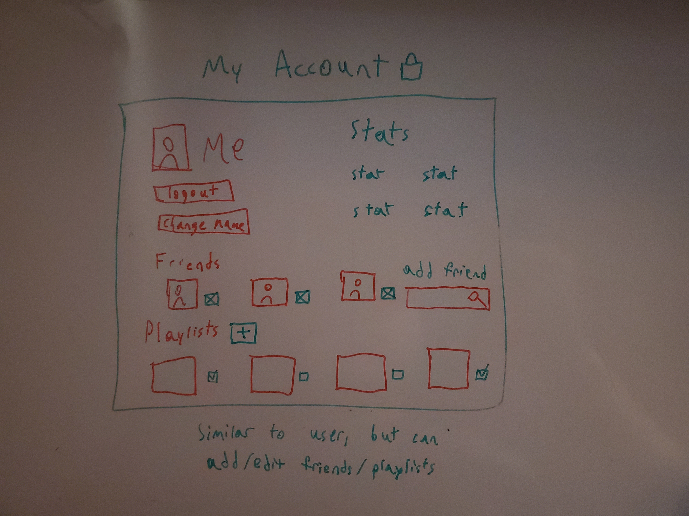
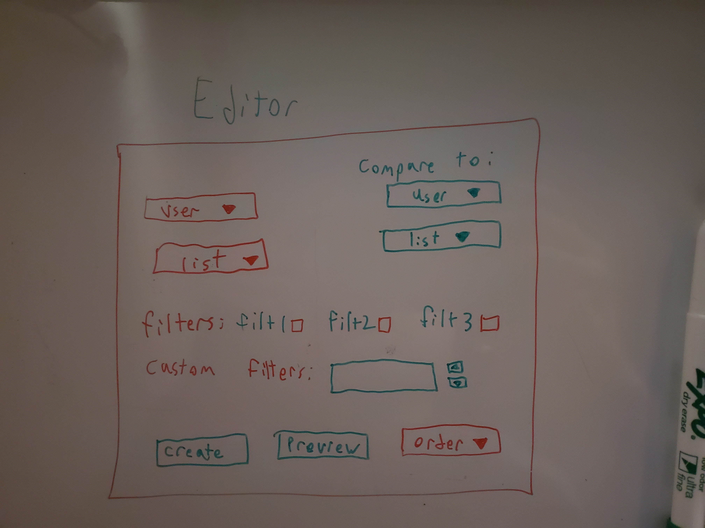

The content below is an example project proposal / requirements document. Replace the text below the lines marked "__TODO__" with details specific to your project. Remove the "TODO" lines.

# Spotify explorer

## Overview

This will be a site that will allow users to filter, and analyze their music taste, as well as compare with other people who they can add as friends.  The site will be very customizable, with users being able to add friends and remove as they please, as well as change their username and profile picture.  Users will be able to view their own or their friend's music, and apply filters in order to see certain subsets of their playlist.  This will involve using the spotify API to sort and filter by various statistics.


## Data Model

The application will store Users, Songs, Lists of songs, and Friends

* users have one associated list of songs, and one associated list of friends, as many as they wish
* each friend is another user, with their own song list


An Example User:

```javascript
{
  id: uniqueIdentifier
  username: "musicEnjoyer",
  profile pic: image.png
  list: // an array of songs
  friends: // an array of other user's names
}
```
A Song:

```javascript
{
  title: //name of song
  artist: //singer of the song
  duration: //length of song
}
```


## [Link to Commented First Draft Schema](db.mjs) 

## Wireframes

/login - page for logging into your account


/myAccount - page for viewing and managing your friends and playlists as well as changing your name or logging out



/Editor - page for filtering, creating, previewing, and viewing playlsits



/User - page for viewing other people's account, typically friends, so you can see their friends and playlist


## Site map

Basic site [map](documentation/SiteMap.jpg)

## User Stories or Use Cases

1. as non-registered user, I can register a new account with the site by logging in with spotify
2. as a user, I can log in to the site
3. as a user, I can add friends, and view my friends' accounts to see their playlist
4. as a user, I can view my playlist
5. as a user, I can create new playlists by uploading playlist ids
6. as a user, I can preview any playlist or subset thereof, by applying filters on my existing playlists
7. as a user, I can change my username, or profile picture, or logout

## Research Topics

* (5 points) Integrate user authentication
    * I'm going to be using passport for user authentication
    * Make users log in with spotify
    * Ensure users remain logged in to view, but may log out
* (5 points) Spotify API
    * use the spotify API to get songs/playlists, and find information about them
    * use spotify API for default username, ID, and pfp

10 points total out of 10 required points


## [Link to Initial Main Project File](app.mjs) 

## Annotations / References Used

1. [passport.js authentication docs](http://passportjs.org/docs)
2. [passport - spotify example](https://calebbbbs.medium.com/passport-with-spotify-59a569a2c1bb)
3. [spotify dev resources](https://developer.spotify.com/documentation/web-api)
