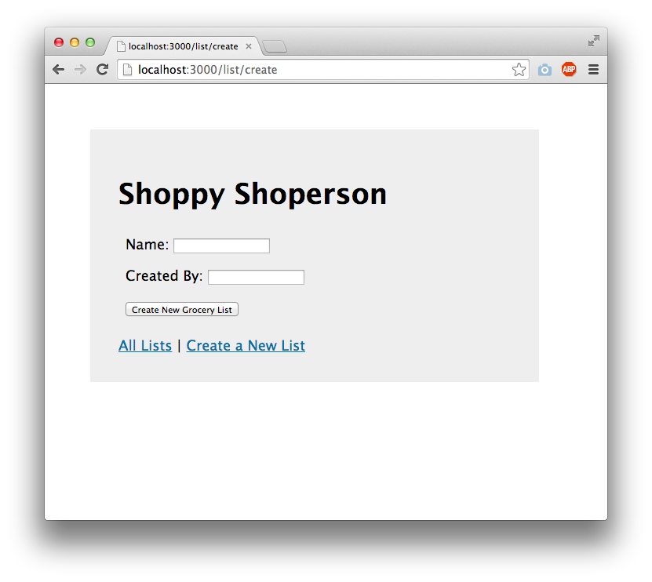
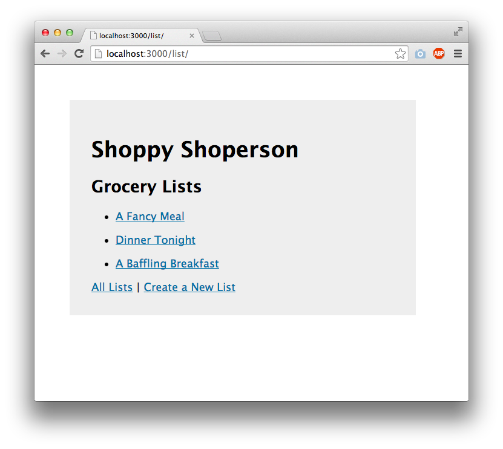

The content below is an example project proposal / requirements document. Replace the text below the lines marked "__TODO__" with details specific to your project. Remove the "TODO" lines.

# Spotify explorer

## Overview

This will be a site that will allow users to filter, create, and analyze their music taste, as well as compare with other people.  There are many sites that use the Spotify API to tell you very specific things about your music taste, but this will allow the user to choose what statistics they want to see, make and manage playlists using this information.  They will also be able to have friends, and view their friend's music, and apply filters in a similar way.  This will involve using the spotify API to sort and filter by various statistics such as genre, popularity, length, artist, album, or intersection with other playlists.


## Data Model

The application will store Users, Lists of songs, and Friends

* users can have as many lists and friends as they choose
* each friend is another user, with their own song lists


An Example User:

```javascript
{
  username: "musicEnjoyer",
  hash: // a password hash,
  lists: // an array of song lists
  friends: // an array of other user's names
}
```

A Song List:

```javascript
{
  playlsitName: //name of list
  songs: //an array of song objects {title: \\songtitle, artist: \\songartist}
}
```


## [Link to Commented First Draft Schema](db.mjs) 

## Wireframes

(__TODO__: wireframes for all of the pages on your site; they can be as simple as photos of drawings or you can use a tool like Balsamiq, Omnigraffle, etc.)

/list/create - page for creating a new shopping list



/list - page for showing all shopping lists



/list/slug - page for showing specific shopping list


## Site map

(__TODO__: draw out a site map that shows how pages are related to each other)

Here's a [complex example from wikipedia](https://upload.wikimedia.org/wikipedia/commons/2/20/Sitemap_google.jpg), but you can create one without the screenshots, drop shadows, etc. ... just names of pages and where they flow to.

## User Stories or Use Cases

(__TODO__: write out how your application will be used through [user stories](http://en.wikipedia.org/wiki/User_story#Format) and / or [use cases](https://en.wikipedia.org/wiki/Use_case))

1. as non-registered user, I can register a new account with the site
2. as a user, I can log in to the site
3. as a user, I can create a new grocery list
4. as a user, I can view all of the grocery lists I've created in a single list
5. as a user, I can add items to an existing grocery list
6. as a user, I can cross off items in an existing grocery list

## Research Topics

(__TODO__: the research topics that you're planning on working on along with their point values... and the total points of research topics listed)

* (5 points) Integrate user authentication
    * I'm going to be using passport for user authentication
    * And account has been made for testing; I'll email you the password
    * see <code>cs.nyu.edu/~jversoza/ait-final/register</code> for register page
    * see <code>cs.nyu.edu/~jversoza/ait-final/login</code> for login page
* (4 points) Perform client side form validation using a JavaScript library
    * see <code>cs.nyu.edu/~jversoza/ait-final/my-form</code>
    * if you put in a number that's greater than 5, an error message will appear in the dom
* (5 points) vue.js
    * used vue.js as the frontend framework; it's a challenging library to learn, so I've assigned it 5 points

10 points total out of 8 required points (___TODO__: addtional points will __not__ count for extra credit)


## [Link to Initial Main Project File](app.mjs) 

(__TODO__: create a skeleton Express application with a package.json, app.mjs, views folder, etc. ... and link to your initial app.mjs)

## Annotations / References Used

(__TODO__: list any tutorials/references/etc. that you've based your code off of)

1. [passport.js authentication docs](http://passportjs.org/docs) - (add link to source code that was based on this)
2. [tutorial on vue.js](https://vuejs.org/v2/guide/) - (add link to source code that was based on this)

